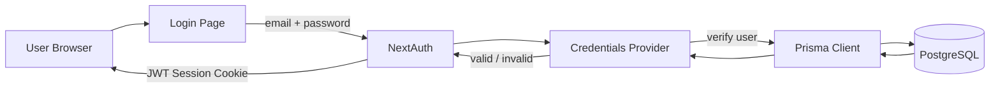
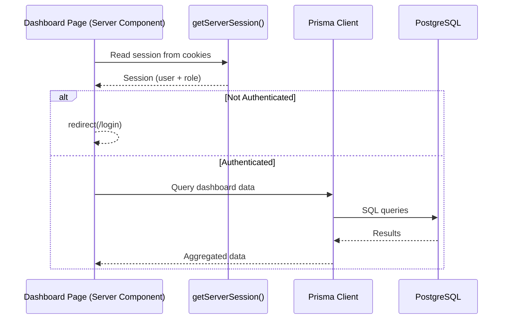
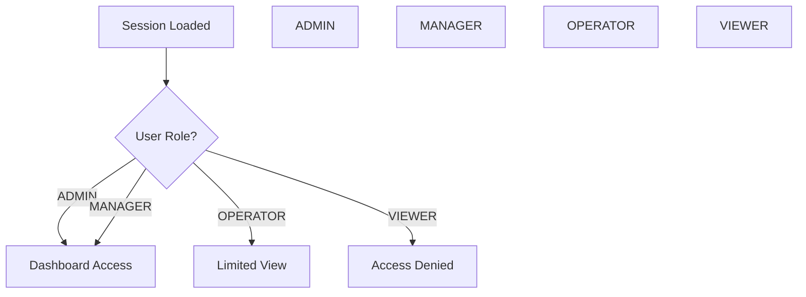
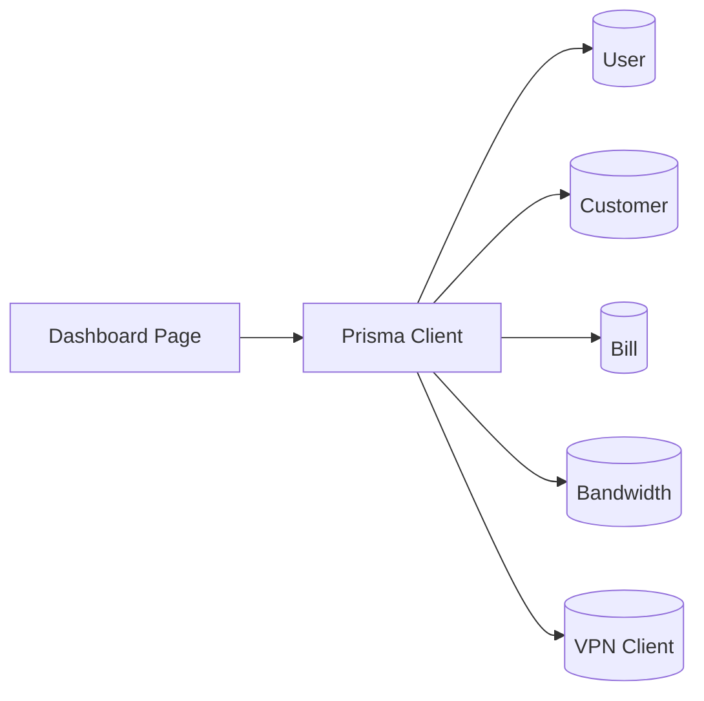
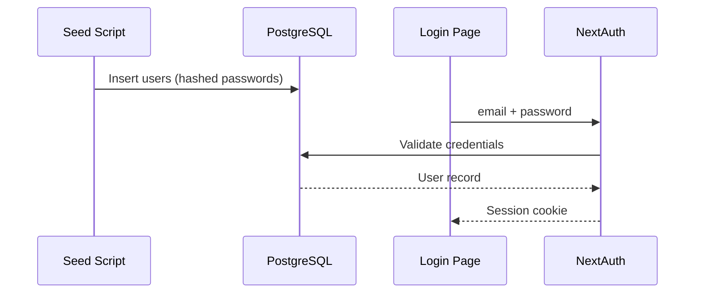

# Prisma + NextAuth Architecture Diagrams

This document contains architecture diagrams explaining how Prisma and NextAuth work together in this project.

---

## 1. High-Level Authentication Flow

---

## 2. Server Component + Prisma Data Flow

---

## 3. Role-Based Access Control (RBAC)

---

## 4. Prisma Dashboard Data Sources

---

## 5. Seed → Login → Session Lifecycle

---

## Notes

- Diagrams are written in Mermaid
- GitHub and GitLab render them automatically
- Use in README or docs folder
